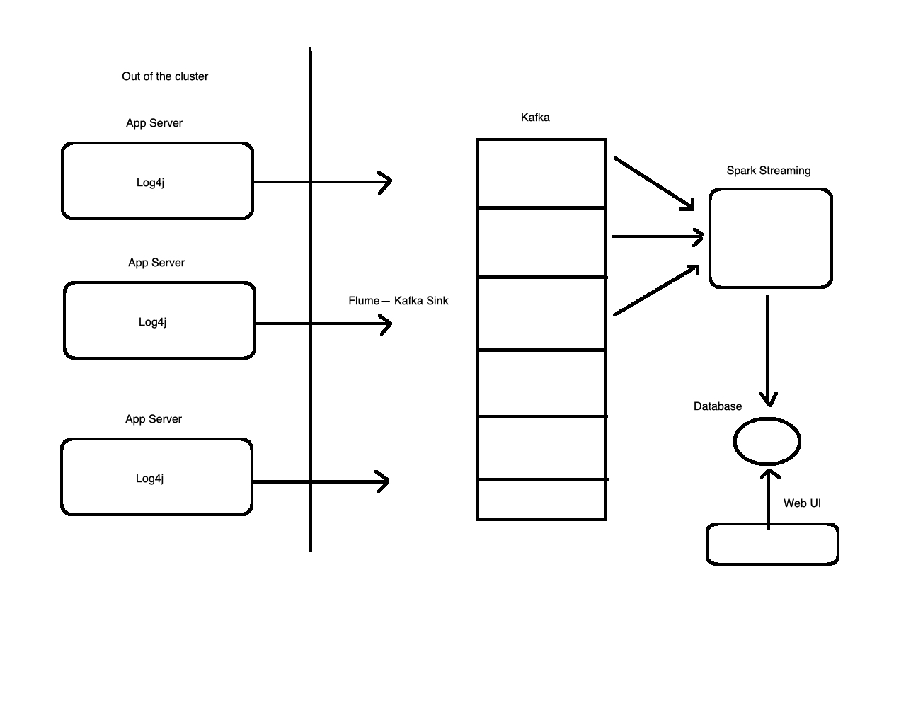

# Spark Streaming Realtime Processing Project

## Project Information

### Project Needs
* Client access information and the geographic information distribution
* Client: User agent
* Process: Offline Spark


### Project Steps
* ip information, useragent
* Statistical analysis: Spark

### project Architecture
* Log collection: Flume
* Offline analysis: Spark
* operational monitoring data: Kafka
* Real-time data processing engine: Spark-Streaming
* Graphical display of statistical results

## Real-time Processing and Stream Processing

### Real-time Computing
Real-time Computing is a concept that describes any computing system that must respond to changes in the environment according to definite time constraints, usually on the order of milliseconds.

### Offline batch processing
Batch data processing is an extremely efficient way to process large amounts of data that is collected over a period of time.  
Batch processing is the processing of transactions in a group or batch. No user interaction is required once batch processing is underway.While batch processing can be carried out at any time, it is particularly suited to end-of-cycle processing, such as for processing a bank's reports at the end of a day

### Stream Computing
Processing the data and streaming it back out as a single flow. Stream computing enables organizations to process data streams which are always on and never ceasing.

### Real-time Stream Processing
Real-time stream processing is the process of taking action on data at the time the data is generated or published. Historically, real-time processing simply meant data was “processed as frequently as necessary for a particular use case.

## Offline Computing and Real-time Computing
* Data Source
  * Offline: HDFS, historical data(large valume)
  * Real-time: Message queue(Kafka), real-time newly-updated data
* Computing Process
  * Offline: MapReduce: Map + Reduce
  * Real-time: Spark(DStream/SS)
* Process Speed
  * Offline: Slow
  * Real-time: Fast
* Processes
  * Offline: Start -> Destroy
  * Real-time: 7*24

## Real-time Stream Processing Frameworks
### Apache Storm
Apache Storm is a free and open source distributed realtime computation system. Apache Storm makes it easy to reliably process unbounded streams of data, doing for realtime processing what Hadoop did for batch processing. Apache Storm is simple, can be used with any programming language, and is a lot of fun to use!

### Apache Spark Streaming
Spark Streaming is an extension of the core Spark API that enables scalable, high-throughput, fault-tolerant stream processing of live data streams. 

### Linkedin Kafka
A Distributed Streaming Platform.

### Apache Flink
Apache Flink is a framework and distributed processing engine for stateful computations over unbounded and bounded data streams. 

# Flume
Flume is a distributed, reliable, and available service for efficiently collecting, aggregating, and moving large amounts of log data. It has a simple and flexible architecture based on streaming data flows. It is robust and fault tolerant with tunable reliability mechanisms and many failover and recovery mechanisms. It uses a simple extensible data model that allows for online analytic application.

## Getting Started
Web Server ==> Flume ==> HDFS(Target)

1. **Key Components**
 * Source: Collect
 * Channel: Aggregrate
 * Sink: Output
 
 
2. **System Requirements**
 * Java 1.7+(Java 1.8 Recommended)
 * Sufficient memory
 * Sufficient disk space
 * Directory Permissions
 
## Configuring Flume
1. **Download from [here](https://flume.apache.org/download.html)**
2. **Export to PATH**
3. **Configure Flume**
   <pre>
   $ cp flume-env.sh.template flume-env.sh
   </pre>
   
   Export JAVA_HOME in this configuration file
 
   Check Flume Version
   <pre>
   $ flume-ng version
   </pre>
   <pre>
   xiangluo@Xiangs-MacBook-Pro ~ % flume-ng version      
   Flume 1.9.0
   Source code repository: https://git-wip-us.apache.org/repos/asf/flume.git
   Revision: d4fcab4f501d41597bc616921329a4339f73585e
   Compiled by fszabo on Mon Dec 17 20:45:25 CET 2018
   From source with checksum 35db629a3bda49d23e9b3690c80737f9
   </pre>
   
## Flume Example
1. **Flume Example1**
     Collect the data from one specific netwok port and print the information in the console
     
     One example.conf file is for a single-node Flume configuration
     a1:agent name  
     r1:source name  
     k1:sink name  
     c1:channel name  
     <pre>
     # example.conf: A single-node Flume configuration

     # Name the components on this agent
     a1.sources = r1
     a1.sinks = k1
     a1.channels = c1

     # Describe/configure the source
     a1.sources.r1.type = netcat
     a1.sources.r1.bind = localhost
     a1.sources.r1.port = 43444

     # Describe the sink
     a1.sinks.k1.type = logger

     # Use a channel which buffers events in memory
     a1.channels.c1.type = memory
     a1.channels.c1.capacity = 1000
     a1.channels.c1.transactionCapacity = 100

     # Bind the source and sink to the channel
     a1.sources.r1.channels = c1
     a1.sinks.k1.channel = c1
     </pre>
     
     Start the Flume agent
     
     <pre>
     flume-ng agent \
     --name a1 \
     --conf $FLUME_HOME/conf \
     --conf-file $FLUME_HOME/conf/example.conf \
     -Dflume.root.logger=INFO,console
     </pre>
     
     Test Flume agent with telnet in another terminal
     
     telnet localhost 43444
     
     Enter "hello" and "world" in the console
     <pre>
     2020-04-23 23:03:31,177 (SinkRunner-PollingRunner-DefaultSinkProcessor) [INFO -     org.apache.flume.sink.LoggerSink.process(LoggerSink.java:95)] Event: { headers:{} body: 68 65 6C 6C 6F 0D                               hello. }
     2020-04-23 23:03:35,186 (SinkRunner-PollingRunner-DefaultSinkProcessor) [INFO - org.apache.flume.sink.LoggerSink.process(LoggerSink.java:95)] Event: { headers:{} body: 77 6F 72 6C 64 0D                               world. }
     </pre>
     
     Event is the basic unit in Flume data transfer
     
     Event = optional header + byte array
     
2. **Flume Example2**

     Monitor a file and collect real-time updated new data and print them in the console
     
     Create a new conf file, exec_memory_logger.conf
     
     <pre>
     # example.conf: A single-node Flume configuration

     # Name the components on this agent
     a1.sources = r1
     a1.sinks = k1
     a1.channels = c1

     # Describe/configure the source
     a1.sources.r1.type = exec
     a1.sources.r1.command = tail -F /Users/xiangluo/data/example.log
     a1.sources.r1.shell = /bin/sh -c

     # Describe the sink
     a1.sinks.k1.type = logger

     # Use a channel which buffers events in memory
     a1.channels.c1.type = memory
     a1.channels.c1.capacity = 1000
     a1.channels.c1.transactionCapacity = 100

     # Bind the source and sink to the channel
     a1.sources.r1.channels = c1
     a1.sinks.k1.channel = c1
     </pre>
     
     Create a empty log file in the target folder
     
     <pre>
     $ touch example.log
     </pre>
     
     Start the Flume agent
     
     <pre>
     flume-ng agent \
     --name a1 \
     --conf $FLUME_HOME/conf \
     --conf-file $FLUME_HOME/conf/exec_memory_logger.conf \
     -Dflume.root.logger=INFO,console
     </pre>     
     
     Add some data in the monitored log file
     
     <pre>
     $ echo hello >> example.log
     </pre>
     
     <pre>
     2020-04-23 23:17:41,926 (SinkRunner-PollingRunner-DefaultSinkProcessor) [INFO - org.apache.flume.sink.LoggerSink.process(LoggerSink.java:95)] Event: { headers:{} body: 68 65 6C 6C 6F                                  hello }
     </pre>
     
3. **Flume Example3**
     
     Collect the log from Server A and transfer it to Server B
     
     Create the first conf file, exec-memory-avro.conf
     <pre>
     # example.conf: A single-node Flume configuration

     # Name the components on this agent
     exec-memory-avro.sources = exec-source
     exec-memory-avro.sinks = avro-sink
     exec-memory-avro.channels = memory-channel

     # Describe/configure the source
     exec-memory-avro.sources.exec-source.type = exec
     exec-memory-avro.sources.exec-source.command = tail -F /Users/xiangluo/data/example.log
     exec-memory-avro.sources.exec-source.shell = /bin/sh -c

     # Describe the sink
     exec-memory-avro.sinks.avro-sink.type = avro
     exec-memory-avro.sinks.avro-sink.hostname = localhost
     exec-memory-avro.sinks.avro-sink.port = 44444

     # Use a channel which buffers events in memory
     exec-memory-avro.channels.memory-channel.type = memory
     exec-memory-avro.channels.memory-channel.capacity = 1000
     exec-memory-avro.channels.memory-channel.transactionCapacity = 100

     # Bind the source and sink to the channel
     exec-memory-avro.sources.exec-source.channels = memory-channel
     exec-memory-avro.sinks.avro-sink.channel = memory-channel
     </pre>
     
     Create the second conf file, avro-memory-logger.conf
     
     <pre>
     # example.conf: A single-node Flume configuration

     # Name the components on this agent
     avro-memory-logger.sources = avro-source
     avro-memory-logger.sinks = logger-sink
     avro-memory-logger.channels = memory-channel

     # Describe/configure the source
     avro-memory-logger.sources.avro-source.type = avro
     avro-memory-logger.sources.avro-source.bind = localhost
     avro-memory-logger.sources.avro-source.port = 44444

     # Describe the sink
     avro-memory-logger.sinks.logger-sink.type = logger

     # Use a channel which buffers events in memory
     avro-memory-logger.channels.memory-channel.type = memory
     avro-memory-logger.channels.memory-channel.capacity = 1000
     avro-memory-logger.channels.memory-channel.transactionCapacity = 100

     # Bind the source and sink to the channel
     avro-memory-logger.sources.avro-source.channels = memory-channel
     avro-memory-logger.sinks.logger-sink.channel = memory-channel
     </pre>
     
     Start the Flume agent
     <pre>
     First:
     flume-ng agent \
     --name avro-memory-logger \
     --conf $FLUME_HOME/conf \
     --conf-file $FLUME_HOME/conf/avro-memory-logger.conf \
     -Dflume.root.logger=INFO,console
     
     Second:
     flume-ng agent \
     --name exec-memory-avro \
     --conf $FLUME_HOME/conf \
     --conf-file $FLUME_HOME/conf/exec-memory-avro.conf \
     -Dflume.root.logger=INFO,console
     </pre>
     
     Add some data in the monitored log file
     
     <pre>
     $ echo hello flink >> example.log
     </pre>
     
     <pre>
     2020-04-23 23:50:47,353 (SinkRunner-PollingRunner-DefaultSinkProcessor) [INFO - org.apache.flume.sink.LoggerSink.process(LoggerSink.java:95)] Event: { headers:{} body: 68 65 6C 6C 6F 20 66 6C 69 6E 6B                hello flink }
     </pre>
     
     
# Kafka

A Distributed Streaming Platform.

Kafka is generally used for two broad classes of applications:

Building real-time streaming data pipelines that reliably get data between systems or applications

Building real-time streaming applications that transform or react to the streams of data

## Getting Started

1. **Key Components**
 * Producer
 * Consumer
 * Broker
 * Topic
 
2. **System Requirements**
 * Zookeeper
 
  Kafka is run as a cluster on one or more servers that can span multiple datacenters. The Kafka cluster stores streams of records in categories called topics. Each record consists of a *key, a value, and a timestamp*.
 
## Configuring Kafka
1. **Download Zookeeper
2. **Export to PATH**
     Add to PATH and change the dataDir
     
     Start Zookeeper Server
     <pre>
     $ zkServer.sh start
     </pre>
     
     Login Zookeeper Server
     <pre>
     $ zkCli.sh
     </pre>
     
3. **Configure Kafka**
     Download Kafka(Note the version of Scala, here we use 0.9.0.0)
     
     Export to PATH
     
     Change the path of log.dirs
     
     Single node single broker setup
     
     * Start Kafka Server
     <pre>
     $ kafka-server-start.sh $KAFKA_HOME/config/server.properties 
     </pre>
     
     * Create a topic
     <pre>
     $ kafka-topics.sh --create --zookeeper localhost:2181 --replication-factor 1 --partitions 1 --topic kafkatest
     </pre>
     
     * Check all the topics
     <pre>
     $ kafka-topics.sh --list --zookeeper localhost:2181
     </pre>
     
     * Send some messages
     <pre>
     $ kafka-console-producer.sh --broker-list localhost:9092 --topic kafkatest
     </pre>
     
     * Start a consumer
     <pre>
     $ kafka-console-consumer.sh --zookeeper localhost:2181 --topic kafkatest --from-beginning
     </pre>
     
     * Check the information of the topic
     <pre>
     $ kafka-topics.sh --describe --zookeeper localhost:2181
     </pre>
     
      <pre>
     $ kafka-topics.sh --describe --zookeeper localhost:2181 --topic kafkatest
     </pre>
     
     Single node multi-broker cluster setup
     
     Create config file
     
     <pre>
     $ cp config/server.properties config/server-1.properties
     $ cp config/server.properties config/server-2.properties
     $ cp config/server.properties config/server-3.properties
     </pre>
     
     Edit the config files with the following properties
     
     <pre>
     config/server-1.properties:
     broker.id=1
     listeners=PLAINTEXT://:9093
     log.dirs=/tmp/kafka-logs-1
 
     config/server-2.properties:
     broker.id=2
     listeners=PLAINTEXT://:9094
     log.dirs=/tmp/kafka-logs-2

     config/server-3.properties:
     broker.id=3
     listeners=PLAINTEXT://:9095
     log.dirs=/tmp/kafka-logs-3
     </pre>
     
     Start Kafka Server
     <pre>
     $ kafka-server-start.sh -daemon $KAFKA_HOME/config/server-1.properties 
     $ kafka-server-start.sh -daemon $KAFKA_HOME/config/server-2.properties
     $ kafka-server-start.sh -daemon $KAFKA_HOME/config/server-3.properties
     </pre>
     
     Create topic
     <pre>
     $ kafka-topics.sh --create --zookeeper localhost:2181 --replication-factor 3 --partitions 1 --topic my-replicated-topic
     </pre>
     
     Send some messages
     <pre>
     $ kafka-console-producer.sh --broker-list localhost:9093,localhost:9094,localhost:9095 --topic my-replicated-topic
     </pre>
     
     Start a consumer
     <pre>
     $ kafka-console-consumer.sh --zookeeper localhost:2181 --topic my-replicated-topic --from-beginning
     </pre>
     
3. **Some errors**
     A Kafka instance in another process or thread is using this directory.

     Step1:
     
     remove .lock file
     
     Step2:
     
     remove the log folder
     
     Step3:
     
     Get new error
     
     Socket server failed to bind to 0.0.0.0:9092: Address already in use
     
     <pre>
     $ lsof -n -i :9092 | grep LISTEN
     $ kill -9 process_no
     </pre>
     
     Start the Kafka Server again, then it works
     
     
4. **Fault-Tolerant Test**

     If we shut down any Kafka Server, even including the Leader, the Kafka Server could still work as usual.
     
     

# Integrate Flume and Kafka to collect data

## Configuration

   Here we can make some changes on the avro-memory-logger.conf to create a new avro-memory-kafka.conf file.
   
   <pre>
   # Name the components on this agent
   avro-memory-kafka.sources = avro-source
   avro-memory-kafka.sinks = kafka-sink
   avro-memory-kafka.channels = memory-channel

   # Describe/configure the source
   avro-memory-kafka.sources.avro-source.type = avro
   avro-memory-kafka.sources.avro-source.bind = localhost
   avro-memory-kafka.sources.avro-source.port = 44444

   # Describe the sink
   avro-memory-kafka.sinks.kafka-sink.type = org.apache.flume.sink.kafka.KafkaSink
   avro-memory-kafka.sinks.kafka-sink.topic = flume
   avro-memory-kafka.sinks.kafka-sink.brokerList = localhost:9095
   avro-memory-kafka.sinks.kafka-sink.batchSize = 5
   avro-memory-kafka.sinks.kafka-sink.requiredAcks = 1


   # Use a channel which buffers events in memory
   avro-memory-kafka.channels.memory-channel.type = memory
   avro-memory-kafka.channels.memory-channel.capacity = 1000
   avro-memory-kafka.channels.memory-channel.transactionCapacity = 100

   # Bind the source and sink to the channel
   avro-memory-kafka.sources.avro-source.channels = memory-channel
   avro-memory-kafka.sinks.kafka-sink.channel = memory-channel
   </pre>
   
## Start a Kafka Consumer
   <pre>
   $ kafka-console-consumer.sh --zookeeper localhost:2181 --topic flume
   </pre>

## Load new data into the example.log file
   <pre>
   $ echo 1 >> example.log
   </pre>
   
   Then the data will be consumed by Kafka Consumer.


# Building Spark
#


# Spark Streaming

## What is Spark Streaming

Spark Streaming is an extension of the core Spark API that enables scalable, high-throughput, fault-tolerant stream processing of live data streams. Data can be ingested from many sources like Kafka, Flume, Kinesis, or TCP sockets, and can be processed using complex algorithms expressed with high-level functions like map, reduce, join and window. Finally, processed data can be pushed out to filesystems, databases, and live dashboards. In fact, you can apply Spark’s machine learning and graph processing algorithms on data streams.


Spark Streaming is released with Spark 0.9

Spark Sql is released with Spark 1.0.0

## Example

Use spark-submit


Start a port
```
$ nc -lk 9999
```

```
spark-submit \
--class org.apache.spark.examples.streaming.NetworkWordCount \
--master local \
--name NetworkWordCount \
/Users/xiangluo/app/spark-2.4.5-bin-hadoop2.7/examples/jars/spark-examples_2.11-2.4.5.jar localhost 9999
```

Use spark-shell

```
spark-shell --master local

import org.apache.spark.streaming.{Seconds, StreamingContext}
val ssc = new StreamingContext(sc, Seconds(1))
val lines = ssc.socketTextStream("localhost", 9999)
val words = lines.flatMap(_.split(" "))
val wordCounts = words.map(x => (x, 1)).reduceByKey(_ + _)
wordCounts.print()
ssc.start()
ssc.awaitTermination()
```

Note:

ssc.socketTextStream
ssc.textFileStream

For socketTextStream local[1] is fine, because it is a local file path, but for socketTextStream, local[?] ?>=2 is needed because there is a receiver that need thread

## DStream

Discretized Streams (DStreams)

Discretized Stream or DStream is the basic abstraction provided by Spark Streaming. It represents a continuous stream of data, either the input data stream received from source, or the processed data stream generated by transforming the input stream. Internally, a DStream is represented by a continuous series of RDDs, which is Spark’s abstraction of an immutable, distributed dataset (see Spark Programming Guide for more details). Each RDD in a DStream contains data from a certain interval, as shown in the following figure.


The operations applied on each DStream, such as map,flatmap can be regarded that the operation is applied on each RDD in DStream, because each DStream is consist of RDD in different batch.


## Input DStreams and Receivers

Input DStreams are DStreams representing the stream of input data received from streaming sources. In the quick example, lines was an input DStream as it represented the stream of data received from the netcat server. Every input DStream (except file stream, discussed later in this section) is associated with a Receiver (Scala doc, Java doc) object which receives the data from a source and stores it in Spark’s memory for processing.

## UpdateStateByKey function

updateStateByKey(func)	Return a new "state" DStream where the state for each key is updated by applying the given function on the previous state of the key and the new values for the key. This can be used to maintain arbitrary state data for each key.


```
object StatefulWordCount {
  def main(args: Array[String]): Unit = {

    val sparkconf: SparkConf = new SparkConf().setMaster("local[2]").setAppName("NerworkWordCount") //local[?] ?>=2 is needed because there is a receiver that need thread
    val ssc = new StreamingContext(sparkconf, Seconds(1))
    
    //it is recommended that the checkpont should be a folder on HDFS
    ssc.checkpoint(".")

    val lines = ssc.socketTextStream("localhost", 8888)
    val words = lines.flatMap(_.split(" ")).map((_,1)) //(x => (x, 1))
    val state = words.updateStateByKey[Int](updateFunction _)

    state.print()
    ssc.start()
    ssc.awaitTermination()
  }


  /**
   * update the current data or old data
   * @param currentValues current data
   * @param preValues old data
   * @return
   */
  def updateFunction(currentValues: Seq[Int], preValues: Option[Int]): Option[Int] ={
    val current = currentValues.sum
    val pre = preValues.getOrElse(0)
    Some(current + pre)
  }
}
```
## Checkpointing

A streaming application must operate 24/7 and hence must be resilient to failures unrelated to the application logic (e.g., system failures, JVM crashes, etc.). For this to be possible, Spark Streaming needs to checkpoint enough information to a fault- tolerant storage system such that it can recover from failures. There are two types of data that are checkpointed.

Metadata checkpointing - Saving of the information defining the streaming computation to fault-tolerant storage like HDFS. This is used to recover from failure of the node running the driver of the streaming application (discussed in detail later). Metadata includes:

 Configuration - The configuration that was used to create the streaming application.

 DStream operations - The set of DStream operations that define the streaming application.

 Incomplete batches - Batches whose jobs are queued but have not completed yet.

Data checkpointing - Saving of the generated RDDs to reliable storage. This is necessary in some stateful transformations that combine data across multiple batches. In such transformations, the generated RDDs depend on RDDs of previous batches, which causes the length of the dependency chain to keep increasing with time. To avoid such unbounded increases in recovery time (proportional to dependency chain), intermediate RDDs of stateful transformations are periodically checkpointed to reliable storage (e.g. HDFS) to cut off the dependency chains.

To summarize, metadata checkpointing is primarily needed for recovery from driver failures, whereas data or RDD checkpointing is necessary even for basic functioning if stateful transformations are used.

When to enable Checkpointing
Checkpointing must be enabled for applications with any of the following requirements:

Usage of stateful transformations - If either updateStateByKey or reduceByKeyAndWindow (with inverse function) is used in the application, then the checkpoint directory must be provided to allow for periodic RDD checkpointing.
Recovering from failures of the driver running the application - Metadata checkpoints are used to recover with progress information.

Note that simple streaming applications without the aforementioned stateful transformations can be run without enabling checkpointing. The recovery from driver failures will also be partial in that case (some received but unprocessed data may be lost). This is often acceptable and many run Spark Streaming applications in this way. Support for non-Hadoop environments is expected to improve in the future.


## Window Operation(windowed computations)

Windowed computations, which allow you to apply transformations over a sliding window of data. The following figure illustrates this sliding window.

As shown in the figure, every time the window slides over a source DStream, the source RDDs that fall within the window are combined and operated upon to produce the RDDs of the windowed DStream. In this specific case, the operation is applied over the last 3 time units of data, and slides by 2 time units. This shows that any window operation needs to specify two parameters.

window length - The duration of the window (3 in the figure).
sliding interval - The interval at which the window operation is performed (2 in the figure).
These two parameters must be multiples of the batch interval of the source DStream (1 in the figure).

Let’s illustrate the window operations with an example. Say, you want to extend the earlier example by generating word counts over the last 30 seconds of data, every 10 seconds. To do this, we have to apply the reduceByKey operation on the pairs DStream of (word, 1) pairs over the last 30 seconds of data. This is done using the operation reduceByKeyAndWindow.


## Filter Blacklist Example

Input (778,zs), (779,ls),(777,ww)

Blacklist (zs,ls)

(778,zs), (779,ls),(777,ww) left join (zs,ls)

==>(zs,(778,zs)),(ls,(779,ls)),(ww,(777,ww))  left join (zs,true), (ls,true)

==>(zs,((778,zs),true)),(ls,((779,ls),true)),(ww,((777,ww),flase))

join(otherDataset, [numPartitions])	When called on datasets of type (K, V) and (K, W), returns a dataset of (K, (V, W)) pairs with all pairs of elements for each key. Outer joins are supported through leftOuterJoin, rightOuterJoin, and fullOuterJoin.


# Spark Streaming + Flume Integration

## Approach 1: Flume-style Push-based Approach

Flume is designed to push data between Flume agents. In this approach, Spark Streaming essentially sets up a receiver that acts an Avro agent for Flume, to which Flume can push the data. Here are the configuration steps.

### Configure Flume

```
# example.conf: A single-node Flume configuration

# Name the components on this agent
simple-agent.sources = netcat-source
simple-agent.sinks = avro-sink
simple-agent.channels = memory-channel

# Describe/configure the source
simple-agent.sources.netcat-source.type = netcat
simple-agent.sources.netcat-source.bind = localhost
simple-agent.sources.netcat-source.port = 44444

# Describe the sink
simple-agent.sinks.avro-sink.type = avro
simple-agent.sinks.avro-sink.hostname = localhost
simple-agent.sinks.avro-sink.port = 41414

# Use a channel which buffers events in memory
simple-agent.channels.memory-channel.type = memory
simple-agent.channels.memory-channel.capacity = 1000
simple-agent.channels.memory-channel.transactionCapacity = 100

# Bind the source and sink to the channel
simple-agent.sources.netcat-source.channels = memory-channel
simple-agent.sinks.avro-sink.channel = memory-channel

```
 
### Application Development

Add depedency
```
        <dependency>
            <groupId>org.apache.spark</groupId>
            <artifactId>spark-streaming-flume_2.11</artifactId>
            <version>${spark.version}</version>
        </dependency>
```

```
    if(args.length != 2){
      System.err.println("Usage: FlumePushWordCount <hostname> <port>")
      System.exit(1)
    }

    val Array(hostname,port) = args


    val sparkconf = new SparkConf()//.setMaster("local[10]").setAppName("FlumePushWordCount")
    val ssc = new StreamingContext(sparkconf,Seconds(5))

    val flumeStream = FlumeUtils.createStream(ssc,hostname,port.toInt)

    flumeStream.map(x=> new String(x.event.getBody.array()).trim)
        .flatMap(_.split(" ")).map((_,1)).reduceByKey(_+_)
        .print()

    ssc.start()
    ssc.awaitTermination()
```

### Run the application

Start the application first then start the flume agent

```
flume-ng agent \
--name simple-agent \
--conf $FLUME_HOME/conf \
--conf-file $FLUME_HOME/conf/flume_push_streaming.conf \
-Dflume.root.logger=INFO,console
```

```
$ telnet localhost 44444
```

Enter some words then the wordcount information would shown in the console in the intellij

### Run the application with Spark-submit

```
$ ./bin/spark-submit --packages org.apache.spark:spark-streaming-flume_2.12:2.4.5 ...
```
If the package is not downloaded successfully, then we can use --jars 

```
spark-submit \
--class com.louis.spark.FlumePushWordCount \
--master "local[*]" \
--jars /Users/xiangluo/spark-streaming-flume-assembly_2.11-2.4.5.jar \
/Users/xiangluo/Documents/GitHub/Spark-Streaming-Data-Processing/target/Spark-Streaming-Data-Processing-1.0-SNAPSHOT.jar \
localhost 41414
```

Then start flume agent

```
flume-ng agent \
--name simple-agent \
--conf $FLUME_HOME/conf \
--conf-file $FLUME_HOME/conf/flume_push_streaming.conf \
-Dflume.root.logger=INFO,console
```

```
$ telnet localhost 44444
```

Enter some words then the wordcount information would shown in the console.


## Approach 2: Pull-based Approach using a Custom Sink

Instead of Flume pushing data directly to Spark Streaming, this approach runs a custom Flume sink that allows the following.

Flume pushes data into the sink, and the data stays buffered.

Spark Streaming uses a reliable Flume receiver and transactions to pull data from the sink. Transactions succeed only after data is received and replicated by Spark Streaming.

This ensures stronger reliability and fault-tolerance guarantees than the previous approach. However, this requires configuring Flume to run a custom sink. Here are the configuration steps.

### Configure Flume

```
# example.conf: A single-node Flume configuration

# Name the components on this agent
simple-agent.sources = netcat-source
simple-agent.sinks = spark-sink
simple-agent.channels = memory-channel

# Describe/configure the source
simple-agent.sources.netcat-source.type = netcat
simple-agent.sources.netcat-source.bind = localhost
simple-agent.sources.netcat-source.port = 44444

# Describe the sink
simple-agent.sinks.spark-sink.type = org.apache.spark.streaming.flume.sink.SparkSink
simple-agent.sinks.spark-sink.hostname = localhost
simple-agent.sinks.spark-sink.port = 41414

# Use a channel which buffers events in memory
simple-agent.channels.memory-channel.type = memory
simple-agent.channels.memory-channel.capacity = 1000
simple-agent.channels.memory-channel.transactionCapacity = 100

# Bind the source and sink to the channel
simple-agent.sources.netcat-source.channels = memory-channel
simple-agent.sinks.spark-sink.channel = memory-channel
```

### Application Development

Add Depedencies

```
(i) Custom sink JAR: Download the JAR corresponding to the following artifact (or direct link).

 groupId = org.apache.spark
 artifactId = spark-streaming-flume-sink_2.12
 version = 2.4.5
(ii) Scala library JAR: Download the Scala library JAR for Scala 2.12.10. It can be found with the following artifact detail (or, direct link).

 groupId = org.scala-lang
 artifactId = scala-library
 version = 2.12.10
(iii) Commons Lang 3 JAR: Download the Commons Lang 3 JAR. It can be found with the following artifact detail (or, direct link).

 groupId = org.apache.commons
 artifactId = commons-lang3
 version = 3.5
```

```
    if(args.length != 2){
      System.err.println("Usage: FlumePushWordCount <hostname> <port>")
      System.exit(1)
    }

    val Array(hostname,port) = args


    val sparkconf = new SparkConf().setMaster("local[10]").setAppName("FlumePushWordCount")
    val ssc = new StreamingContext(sparkconf,Seconds(5))

    val flumeStream = FlumeUtils.createPollingStream(ssc,hostname,port.toInt)

    flumeStream.map(x=> new String(x.event.getBody.array()).trim)
      .flatMap(_.split(" ")).map((_,1)).reduceByKey(_+_)
      .print()

    ssc.start()
    ssc.awaitTermination()
```
### Run the application

Start the flume agent first then run the application

```
flume-ng agent \
--name simple-agent \
--conf $FLUME_HOME/conf \
--conf-file $FLUME_HOME/conf/flume_pull_streaming.conf \
-Dflume.root.logger=INFO,console
```

```
$ telnet localhost 44444
```

Enter some words then the wordcount information would shown in the console in the intellij


### Solutions for common errors

1) Unable to load sink type: org.apache.spark.streaming.flume.sink.SparkSink, class: org.apache.spark.streaming.flume.sink.SparkSink

Solution: Download the jar packge from pom or (https://search.maven.org/artifact/org.apache.spark/spark-streaming-flume-sink_2.11) and upload the jar file to $FLUME_HOME/lib

2) java.lang.NoClassDefFoundError: Could not initialize class org.apache.spark.streaming.flume.sink.EventBatch or in intellij java.lang.IllegalAccessError: tried to access method org.apache.avro.specific.SpecificData.<init>()V from class org.apache.spark.streaming.flume.sink.EventBatch
 
Solution: 

Download:

```
        <dependency>
            <groupId>org.apache.avro</groupId>
            <artifactId>avro</artifactId>
            <version>1.8.2</version>
        </dependency>
        <!-- https://mvnrepository.com/artifact/org.apache.avro/avro-ipc -->
        <dependency>
            <groupId>org.apache.avro</groupId>
            <artifactId>avro-ipc</artifactId>
            <version>1.8.2</version>
        </dependency>
```
And upload the jar file to $FLUME_HOME/lib

3) java.lang.IllegalStateException: begin() called when transaction is OPEN!
```
        <dependency>
            <groupId>org.scala-lang</groupId>
            <artifactId>scala-library</artifactId>
            <version>${scala.version}</version>
        </dependency>
```

Download the same scala version jar package as in the pom.xml and also upload the jar file to $FLUME_HOME/lib


# Spark Streaming + Kafka Integration

## Approach 1: Receiver-based Approach

This approach uses a Receiver to receive the data. The Receiver is implemented using the Kafka high-level consumer API. As with all receivers, the data received from Kafka through a Receiver is stored in Spark executors, and then jobs launched by Spark Streaming processes the data.

However, under default configuration, this approach can lose data under failures (see receiver reliability. To ensure zero-data loss, you have to additionally enable Write-Ahead Logs in Spark Streaming (introduced in Spark 1.2). This synchronously saves all the received Kafka data into write-ahead logs on a distributed file system (e.g HDFS), so that all the data can be recovered on failure. See Deploying section in the streaming programming guide for more details on Write-Ahead Logs.

### Start Kafka

```
Start zookeeper

./zkServer.sh start

Start Kafka Server

 ./kafka-server-start.sh /Users/xiangluo/app/kafka_2.11-0.9.0.0/config/server-1.properties //9093

Create a topic

./kafka-topics.sh --create --zookeeper localhost:2181 --replication-factor 1 --partitions 1 --topic kafka_streaming_topic

Show all the topics

./kafka-topics.sh --list --zookeeper localhost:2181

Start a producer

./kafka-console-producer.sh --broker-list localhost:9093 --topic kafka_streaming_topic

Start a consumer

./kafka-console-consumer.sh --zookeeper localhost:2181 --topic kafka_streaming_topic
```
 
### Application Development

Add depedency
```
        <dependency>
            <groupId>org.apache.spark</groupId>
            <artifactId>spark-streaming-kafka-0-8_2.11</artifactId>
            <version>${spark.version}</version>
        </dependency>
```

```
    if (args.length != 4) {
      System.err.println("usage: zkQuorum, group, topics, numThreads")
      System.exit(1)
    }

    val Array(zkQuorum, group, topics, numThreads) = args
    val sparkconf = new SparkConf().setAppName("KafkaReceiverWordCount").setMaster("local[10]")
    val ssc = new StreamingContext(sparkconf, Seconds(5))

    //integrate kafka
    val topicsMap = topics.split((",")).map((_, numThreads.toInt)).toMap
    val message = KafkaUtils.createStream(ssc, zkQuorum, group, topicsMap)

    message.map(_._2).flatMap(_.split(" ")).map((_,1)).reduceByKey(_+_).print()

    ssc.start()
    ssc.awaitTermination()
```

### Run the application

Run the application in Intellij

### Run the application with Spark-submit

Maven pom.xml configuration // include all the depedencies in the jar file.

```
<build>
        <sourceDirectory>src/main/scala</sourceDirectory>
        <plugins>
            <plugin>
                <groupId>net.alchim31.maven</groupId>
                <artifactId>scala-maven-plugin</artifactId>
                <version>3.1.6</version>
                <executions>
                    <execution>
                        <phase>compile</phase>
                        <goals>
                            <goal>compile</goal>
                            <goal>testCompile</goal>
                        </goals>
                    </execution>
                </executions>
            </plugin>

            <plugin>
                <groupId>org.apache.maven.plugins</groupId>
                <artifactId>maven-shade-plugin</artifactId>
                <version>2.3</version>
                <executions>
                    <execution>
                        <phase>package</phase>
                        <goals>
                            <goal>shade</goal>
                        </goals>
                        <configuration>
                            <shadedArtifactAttached>true</shadedArtifactAttached>
                            <filters>
                                <filter>
                                    <artifact>*:*</artifact>
                                    <excludes>
                                        <exclude>META-INF/*.SF</exclude>
                                        <exclude>META-INF/*.DSA</exclude>
                                        <exclude>META-INF/*.RSA</exclude>
                                    </excludes>
                                </filter>
                            </filters>
                            <artifactSet>
                                <includes>
                                    <include>*:*</include>
                                </includes>
                            </artifactSet>
                            <transformers>
                                <transformer
                                        implementation="org.apache.maven.plugins.shade.resource.AppendingTransformer">
                                    <resource>reference.conf</resource>
                                </transformer>
                            </transformers>
                        </configuration>
                    </execution>
                </executions>
            </plugin>
        </plugins>
    </build>
```

spark-submit \
--class com.louis.spark.KafkaReceiverWordCount \
--master "local[*]" \
--name KafkaReceiverWordCount \
/Users/xiangluo/Documents/GitHub/Spark-Streaming-Data-Processing/target/Spark-Streaming-Data-Processing-1.0-SNAPSHOT-shaded.jar \
localhost:2181 test kafka_streaming_topic 2


## Approach 2: Direct Approach (No Receivers)

Instead of using receivers to receive data, this approach periodically queries Kafka for the latest offsets in each topic+partition, and accordingly defines the offset ranges to process in each batch.

This approach has the following advantages over the receiver-based approach (i.e. Approach 1).

Simplified Parallelism: No need to create multiple input Kafka streams and union them. With directStream, Spark Streaming will create as many RDD partitions as there are Kafka partitions to consume, which will all read data from Kafka in parallel. So there is a one-to-one mapping between Kafka and RDD partitions, which is easier to understand and tune.

Efficiency: Achieving zero-data loss in the first approach required the data to be stored in a Write-Ahead Log, which further replicated the data. This is actually inefficient as the data effectively gets replicated twice - once by Kafka, and a second time by the Write-Ahead Log. This second approach eliminates the problem as there is no receiver, and hence no need for Write-Ahead Logs. As long as you have sufficient Kafka retention, messages can be recovered from Kafka.

Exactly-once semantics: The first approach uses Kafka’s high-level API to store consumed offsets in Zookeeper. This is traditionally the way to consume data from Kafka. While this approach (in combination with-write-ahead logs) can ensure zero data loss (i.e. at-least once semantics), there is a small chance some records may get consumed twice under some failures. This occurs because of inconsistencies between data reliably received by Spark Streaming and offsets tracked by Zookeeper. Hence, in this second approach, we use simple Kafka API that does not use Zookeeper. Offsets are tracked by Spark Streaming within its checkpoints. This eliminates inconsistencies between Spark Streaming and Zookeeper/Kafka, and so each record is received by Spark Streaming effectively exactly once despite failures. In order to achieve exactly-once semantics for output of your results, your output operation that saves the data to an external data store must be either idempotent, or an atomic transaction that saves results and offsets (see Semantics of output operations in the main programming guide for further information).

Note that one disadvantage of this approach is that it does not update offsets in Zookeeper, hence Zookeeper-based Kafka monitoring tools will not show progress. However, you can access the offsets processed by this approach in each batch and update Zookeeper yourself (see below).

### Start Kafka

### Application Development

Add depedency
```
        <dependency>
            <groupId>org.apache.spark</groupId>
            <artifactId>spark-streaming-kafka-0-8_2.11</artifactId>
            <version>${spark.version}</version>
        </dependency>
```

```
    if (args.length != 2) {
      System.err.println("usage: brokers,topics")
      System.exit(1)
    }

    val Array(brokers,topics) = args
    val sparkconf = new SparkConf().setAppName("KafkaDirectWordCount").setMaster("local[10]")
    val ssc = new StreamingContext(sparkconf, Seconds(5))

    //integrate kafka
    val topicSet = topics.split(",").toSet

    val kafkaParams = Map[String, String]("metadata.broker.list" -> brokers)

    val message = KafkaUtils.createDirectStream[String,String, StringDecoder,StringDecoder](ssc,kafkaParams,topicSet)

    message.map(_._2).flatMap(_.split(" ")).map((_,1)).reduceByKey(_+_).print()

    ssc.start()
    ssc.awaitTermination()
```

### Run the application

Run the application in Intellij

### Run the application with Spark-submit

spark-submit \
--class com.louis.spark.KafkaDirectWordCount \
--master "local[*]" \
--name KafkaReceiverWordCount \
/Users/xiangluo/Documents/GitHub/Spark-Streaming-Data-Processing/target/Spark-Streaming-Data-Processing-1.0-SNAPSHOT-shaded.jar \
localhost:9093 kafka_streaming_topic


### Solutions for common errors

java.lang.NoSuchMethodError: net.jpountz.lz4.LZ4BlockInputStream.init exception

Solution: Add Depedency

<dependency>
  <groupId>net.jpountz.lz4</groupId>
  <artifactId>lz4</artifactId>
  <version>1.3.0</version>
</dependency>

kafka.cluster.BrokerEndPoint cannot be cast to kafka.cluster.Broker issue

Have too many Kafka dependencies loaded up, and the ones picked up at runtime aren't binary compatible with the version Spark expects.

Solution:

Clean up dependency and all that is needed is:

spark-streaming_2.11-2.4.5,
spark-streaming-kafka-0-10_2.11-2.4.5


# Spark Streaming + Flume + Kafka Integration

## Architecture Solution



## Print log with Log4j

Code

```
import org.apache.log4j.Logger;

public class LoggerGenerator {

    private static Logger logger = Logger.getLogger(LoggerGenerator.class.getName());

    public static void main(String[] args) throws Exception{

        int index = 0;
        while(true){
            Thread.sleep(1000);
            logger.info("value: " + index ++);
        }
    }
}
```

Log configuration

```
log4j.rootLogger=INFO,stdout,flume

log4j.appender.stdout = org.apache.log4j.ConsoleAppender
log4j.appender.stdout.target = System.out
log4j.appender.stdout.layout = org.apache.log4j.PatternLayout
log4j.appender.stdout.layout.ConversionPattern = %d{yyyy-MM-dd HH:mm:ss,SSS} [%t] [%c] [%p] - %m%n
```

Run the LoggerGenerator.java, then there will be log information.


## Use Flume to collect the log information from log4j

### Flume Configuration

```
# Name the components on this agent
agent1.sources = avro-source
agent1.sinks = log-sink
agent1.channels = logger-channel

# Describe/config the source
agent1.sources.avro-source.type = avro
agent1.sources.avro-source.bind = localhost
agent1.sources.avro-source.port = 41414

# Describe the sink
agent1.sinks.log-sink.type = logger

# Define channel
agent1.channels.logger-channel.type = memory

# Bind the source and sink to the channel
agent1.sources.avro-source.channels = logger-channel
agent1.sinks.log-sink.channel = logger-channel
```

Start Flume

```
flume-ng agent \
--name agent1 \
--conf $FLUME_HOME/conf \
--conf-file $FLUME_HOME/conf/streaming.conf \
-Dflume.root.logger=INFO,console
```

Add more configuration in log4j.properties

```
log4j.rootLogger=INFO,stdout,flume

log4j.appender.stdout = org.apache.log4j.ConsoleAppender
log4j.appender.stdout.target = System.out
log4j.appender.stdout.layout = org.apache.log4j.PatternLayout
log4j.appender.stdout.layout.ConversionPattern = %d{yyyy-MM-dd HH:mm:ss,SSS} [%t] [%c] [%p] - %m%n


log4j.appender.flume = org.apache.flume.clients.log4jappender.Log4jAppender
log4j.appender.flume.Hostname = localhost
log4j.appender.flume.Port = 41414
log4j.appender.flume.UnsafeMode = true
```

After you run the application, an error you will get:

java.lang.ClassNotFoundException: org.apache.flume.clients.log4jappender.Log4jAppender

Solution: add depedency

```
        <dependency>
            <groupId>org.apache.flume.flume-ng-clients</groupId>
            <artifactId>flume-ng-log4jappender</artifactId>
            <version>1.6.0</version>
        </dependency>

```


## Use Kakfasink in Flume to transform the data to Kafka

### kafka Server Configuration

Start Zookeeper

```
./zkServer.sh start
```
Start Kafka Server
```
./kafka-server-start.sh $KAFKA_HOME/config/server.properties
```

Check all the existing topics
```
./kafka-topics.sh --list --zookeeper localhost:2181
```

Create a new topic
```
./kafka-topics.sh --create --zookeeper localhost:2181 --replication-factor 1 --partitions 1 --topic streamingtopic
```

Create a new Kafka Consumer
```
./kafka-console-consumer.sh --zookeeper localhost:2181 --topic streamingtopic --from-beginning
```

### Flume Configuration

```
# Name the components on this agent
agent1.sources = avro-source
agent1.sinks = kafka-sink
agent1.channels = logger-channel

# Describe/config the source
agent1.sources.avro-source.type = avro
agent1.sources.avro-source.bind = localhost
agent1.sources.avro-source.port = 41414

# Describe the sink
agent1.sinks.kafka-sink.type = org.apache.flume.sink.kafka.KafkaSink
agent1.sinks.kafka-sink.topic = streamingtopic
agent1.sinks.kafka-sink.brokerList = localhost:9092
agent1.sinks.kafka-sink.batchSize = 20
agent1.sinks.kafka-sink.requiredAcks = 1


# Define channel
agent1.channels.logger-channel.type = memory

# Bind the source and sink to the channel
agent1.sources.avro-source.channels = logger-channel
agent1.sinks.kafka-sink.channel = logger-channel
```


Start Flume

```
flume-ng agent \
--name agent1 \
--conf $FLUME_HOME/conf \
--conf-file $FLUME_HOME/conf/streaming2.conf \
-Dflume.root.logger=INFO,console
```


### Run log generator application, then Kakfa Consumer will get all the data from Flume Sink


## Spark Streaming consumes the data in Kafka Server

Here we use Receiver approach

```
    if (args.length != 4) {
      System.err.println("usage: zkQuorum, group, topics, numThreads")
      System.exit(1)
    }

    val Array(zkQuorum, group, topics, numThreads) = args
    val sparkconf = new SparkConf().setAppName("KafkaStreaming").setMaster("local[10]")
    val ssc = new StreamingContext(sparkconf, Seconds(5))

    //integrate kafka
    val topicsMap = topics.split((",")).map((_, numThreads.toInt)).toMap
    val message = KafkaUtils.createStream(ssc, zkQuorum, group, topicsMap)

    message.map(_._2).count().print()

    ssc.start()
    ssc.awaitTermination()
```

Program arguments: 

localhost:2181 test streamingtopic 1


# Project

## Generate log

```
import random
import time

url_paths = [
        "product/13817625.html",
        "product/12910052.html",
        "product/14056023.html",
        "product/14610854.html",
        "product/14056024.html",
        "product/13817626.html",
        "category/samsung-phones/505988.html",
        "services/geek-squad-services/bltb5f906bfb57d7744.html",
        "search?search=games.html"
        ]
ip_slices = [43,167,43,132,232,124,10,29,143,30,46,55,63,72,87,98]

http_referers = [
        "https://www.bing.com/search?q={query}",
        "https://www.google.com/search?sxsrf={query}"
        ]
search_keywords = {
        "bestbuy",
        "videogame",
        "ps4",
        "xbox",
        "switch"
        }
status_codes = ["200","404","500"]

def sample_url():
    return random.sample(url_paths,1)[0]

def sample_ip():
    slice = random.sample(ip_slices,4)
    return ".".join([str(item) for item in slice])

def sample_referer():
    if random.uniform(0,1) > 0.2:
        return "-"
    refer_str = random.sample(http_referers,1)
    query_str = random.sample(search_keywords,1)
    return refer_str[0].format(query=query_str[0])
 
    
def sample_status_code():
    return random.sample(status_codes,1)[0]

def generate_log(count = 10):
    time_str = time.strftime("%Y-%m-%d %H:%M:%S",time.localtime())
    f = open("/Users/xiangluo/data/log/access.log","w+")
    
    while count >=1:
        query_log = "{ip}\t{local_time}\t\"GET /{url} HTTP/1.1\"\t{status_code}\t{referer}".format(ip=sample_ip(),url=sample_url(),
                     referer= sample_referer(),status_code=sample_status_code(),local_time=time_str)
        print(query_log)
        f.write(query_log + "\n")
        
        count = count -1
if __name__ == '__main__':
    generate_log(100)
    
```

Format: {ip}\t{local_time}\t\"GET \{url} HTTP/1.1\"\t{status_code}\t{referer}

Some samples:

```
43.87.98.63	2020-38-05/27/20 09:38:29	"GET \product/nintendo-switch-console-with-neon-red-blue-joy-con/13817625 HTTP/1.1"	500	https://www.bing.com/search?q=xbox
30.132.232.72	2020-38-05/27/20 09:38:29	"GET \product/playstation-4-pro-1tb-console/12910052 HTTP/1.1"	500	https://www.google.com/search?sxsrf=ps4
10.29.167.132	2020-38-05/27/20 09:38:29	"GET \search?search=games HTTP/1.1"	500	https://www.bing.com/search?q=ps4
87.10.46.43	2020-38-05/27/20 09:38:29	"GET \product/nintendo-switch-console-with-neon-red-blue-joy-con/13817625 HTTP/1.1"	500	https://www.google.com/search?sxsrf=xbox
29.43.167.43	2020-38-05/27/20 09:38:29	"GET \product/playstation-4-pro-1tb-console/12910052 HTTP/1.1"	404	-
143.29.30.63	2020-38-05/27/20 09:38:29	"GET \product/playstation-4-pro-1tb-console/12910052 HTTP/1.1"	500	-
```

### Use timed scheduling tool to generate the log every minute.

Recommandation:

```
crontab -e 

*/1 * * * * /Users/xiangluo/opt/anaconda3/bin/python /Users/xiangluo/Documents/GitHub/Spark-Streaming-Data-Processing/generate_log.py
```

## Use Flume to collect the log


configuration file

```
# Name the components on this agent
a1.sources = r1
a1.sinks = k1
a1.channels = c1

# Describe/configure the source
a1.sources.r1.type = exec
a1.sources.r1.command = tail -F /Users/xiangluo/data/log/access.log
a1.sources.r1.shell = /bin/sh -c

# Describe the sink
a1.sinks.k1.type = logger

# Use a channel which buffers events in memory
a1.channels.c1.type = memory
a1.channels.c1.capacity = 1000
a1.channels.c1.transactionCapacity = 100

# Bind the source and sink to the channel
a1.sources.r1.channels = c1
a1.sinks.k1.channel = c1
```


Run Flume
```
flume-ng agent \
--name a1 \
--conf $FLUME_HOME/conf \
--conf-file $FLUME_HOME/conf/exec_memory_log.conf \
-Dflume.root.logger=INFO,console
```


## Integrate Flume and Kafka to collect the log

```
start zookeeper
./zkServer.sh start

start Kafka Server
./kafka-server-start.sh $KAFKA_HOME/config/server.properties

list all the topics
./kafka-topics.sh --list --zookeeper localhost:2181

start a Kafka consumer
./kafka-console-consumer.sh --zookeeper localhost:2181 --topic streamingtopic 
```


Flume configuration file

```
# example.conf: A single-node Flume configuration

# Name the components on this agent
a1.sources = r1
a1.sinks = k1
a1.channels = c1

# Describe/configure the source
a1.sources.r1.type = exec
a1.sources.r1.command = tail -F /Users/xiangluo/data/log/access.log
a1.sources.r1.shell = /bin/sh -c

# Describe the sink
a1.sinks.k1.type = org.apache.flume.sink.kafka.KafkaSink
a1.sinks.k1.topic = streamingtopic
a1.sinks.k1.brokerList = localhost:9092
a1.sinks.k1.batchSize = 20
a1.sinks.k1.requiredAcks = 1

# Use a channel which buffers events in memory
a1.channels.c1.type = memory
a1.channels.c1.capacity = 1000
a1.channels.c1.transactionCapacity = 100

# Bind the source and sink to the channel
a1.sources.r1.channels = c1
a1.sinks.k1.channel = c1
```

start flume

```
flume-ng agent \
--name a1 \
--conf $FLUME_HOME/conf \
--conf-file $FLUME_HOME/conf/log_memory_kafka.conf \
-Dflume.root.logger=INFO,console
```


## Use Spark Streaming to comsume the data

```
    if (args.length != 4) {
      System.err.println("usage: zkQuorum, group, topics, numThreads")
      System.exit(1)
    }
    val Array(zkQuorum, group, topics, numThreads) = args

    val sparkConf: SparkConf = new SparkConf().setAppName("StreamingApp").setMaster("local[*]")
    val ssc = new StreamingContext(sparkConf, Seconds(10))

    val topicsMap = topics.split((",")).map((_, numThreads.toInt)).toMap

    val message = KafkaUtils.createStream(ssc, zkQuorum, group, topicsMap)

    message.map(_._2).count().print()
```

## Data Cleaning

### 1. Parse time

"2020-05-30 15:37:59" ==> "20200530153759"

```
  val inputFormat = FastDateFormat.getInstance("yyyy-MM-dd HH:mm:ss")
  val outputFormat = FastDateFormat.getInstance("yyyyMMddHHmmss")

  def getTime(time: String) = {
    inputFormat.parse(time).getTime
  }

  def parseToMinute(time: String) = {
    outputFormat.format(new Date(getTime(time)))
  }

  def main(args: Array[String]): Unit = {
    println(parseToMinute("2020-05-30 15:37:59"))
  }
```

### 2. Filter data

```
    val logs = message.map(_._2)
    val cleanData = logs.map(line => {
      //      43.29.63.167	2020-05-30 15:50:25	"GET /product/14610854.html HTTP/1.1"	500	https://www.bing.com/search?q=ps4
      val infos = line.split("\t")
      val url = infos(2).split(" ")(1)
      var productId = 0
      //      "GET /product/12910052.html HTTP/1.1"
      if (url.startsWith("/product")) {
        val productIdHTML = url.split("/")(2)
        productId = productIdHTML.substring(0, productIdHTML.lastIndexOf(".")).toInt
      }
      ClickLog(infos(0), DateUtils.parseToMinute(infos(1)), productId, infos(3).toInt, infos(4))
    }).filter(ClickLog => ClickLog.productId != 0)
```

## Function one: Count the total number of product visit

yyyyMMdd productID

### Which database should we choose to store the data

#### 1. RDBMS

Mysql, Oracle

day productId click_count

The first batch

20200530 1 10
20200530 2 10

The second batch

20200530 1 ==> click_count + new click_count

It's too complicated

#### 2. NoSQL

HBase, Redis

But in HBase, we can use incrementColumnValue method to realize this function.


## Requirement

Start Zookeeper

./zkServer.sh start

Start HDFS

./start-dfs.sh

Start HBase

```
./start-hbase.sh 

./hbase shell

list all the tables in HBase
list

create a new table
create 'product_clickcount','info'

describe 'product_clickcount'
```


## Manipulate HBase

The Utility class in Java should be encapsulated with single instance


```
import org.apache.hadoop.conf.Configuration;
import org.apache.hadoop.hbase.*;
import org.apache.hadoop.hbase.client.*;
import org.apache.hadoop.hbase.filter.*;
import org.apache.hadoop.hbase.util.Bytes;

import java.io.IOException;
import java.util.Iterator;
import java.util.List;

/**
 * Hbase operation
 */
public class HBaseUtils {
    Admin admin = null;
    Connection conn = null;
    Configuration configuration = null;

    private HBaseUtils() {
        configuration = HBaseConfiguration.create();
        configuration.set("hbase.zookeeper.quorum", "localhost");
        configuration.set("hbase.zookeeper.property.clientPort", "2181");
        configuration.set("hbase.rootdir", "hdfs://localhost:9000/hbase");
        try {
            conn = ConnectionFactory.createConnection(configuration);
            admin = conn.getAdmin();
        } catch (IOException e) {
            e.printStackTrace();
        }
    }

    private static HBaseUtils instance = null;

    public static synchronized HBaseUtils getInstance() {
        if (instance == null) {
            instance = new HBaseUtils();
        }
        return instance;
    }

    public void insert(String tableName, String rowKey, String columnFamily, String column, String value) throws IOException {
        Put put = new Put(Bytes.toBytes(rowKey));
        put.addColumn(Bytes.toBytes(columnFamily), Bytes.toBytes(column), Bytes.toBytes(value));
        Table table = conn.getTable(TableName.valueOf(tableName));
        table.put(put);
    }

    public List<TableDescriptor> listTables() throws IOException {
        List<TableDescriptor> tableDescriptors = admin.listTableDescriptors();
        return tableDescriptors;
    }

//    public HTable getTable(String tablename){
//        HTable table = null;
//        try {
//            table = new HTable(configuration, tablename);
//        } catch (IOException e){
//            e.printStackTrace();
//        }
//        return table;

    public Table getTableName(String tableName) {
        Table table = null;
        try {
            table = conn.getTable(TableName.valueOf(tableName));
        } catch (IOException e) {
            e.printStackTrace();
        }
        return table;

    }

    public static void main(String[] args) throws IOException {
//        List tables = HBaseUtils.getInstance().listTables();
////        Iterator it1 = tables.iterator();
////        while(it1.hasNext()){
////            System.out.println(it1.next());
////        }
//        Table table = HBaseUtils.getInstance().getTableName("product_clickcount");
//        System.out.println(table.getName().getNameAsString());
//
//        String tableName = "product_clickcount";
//        String rowKey = "20191111_3223442";
//        String columnFamily = "info";
//        String column = "click_count";
//        String value = "2";
//
//        HBaseUtils.getInstance().insert(tableName, rowKey, columnFamily, column, value);

    }
}
```

DAO level

```
object ProductClickCountDAO {

  val tablName = "product_clickcount"
  val cf = "info"
  val qualifer = "click_count"

  /**
   * save the data to hbase
   *
   * @param list the collection of ProductClickCount
   */
  def save(list: ListBuffer[ProductClickCount]): Unit = {

    val table = HBaseUtils.getInstance().getTableName(tablName)

    for(ele <- list){
      table.incrementColumnValue(Bytes.toBytes(ele.day_product),
        Bytes.toBytes(cf),
        Bytes.toBytes(qualifer),
        ele.click_count)
    }
  }

  /**
   * select the count value according to rowkey
   * @param day_count
   * @return
   */
  def count(day_product: String): Long = {

    val table = HBaseUtils.getInstance().getTableName(tablName)
    val get = new Get(Bytes.toBytes(day_product))
    val value = table.get(get).getValue(cf.getBytes(), qualifer.getBytes())

    if (value == null) {
      0L
    } else {
      Bytes.toLong(value)
    }

  }

  def main(args: Array[String]): Unit = {
    val list = new ListBuffer[ProductClickCount]
    list.append(ProductClickCount("20191111_1",10))
    list.append(ProductClickCount("20191111_2",20))
    list.append(ProductClickCount("20191111_3",30))

    save(list)

    println(count("20191111_1") + ":" + count("20191111_2") + ":" + count("20191111_3"));
  }
}
```


## Write the data from Spark Streaming DStream to HBase

```
    cleanData.map(x => {
      //rowkey
      (x.time.substring(0, 8) + "_" + x.productId, 1)
    }).reduceByKey(_ + _).foreachRDD(rdd => {
      rdd.foreachPartition(partitionRecords => {
        val list = new ListBuffer[ProductClickCount]
        partitionRecords.foreach(pair => {
          list.append(ProductClickCount(pair._1, pair._2))
        })
        ProductClickCountDAO.save(list) //write the data for each partition
      })
    })
```

## Common errors and solutions

Java.lang.NoSuchMethodError: io.netty.buffer.PooledByteBufAllocator.defaultNumHeapArena()I

This error is caused by multiple versions of netty in the dependencies.


Get the dependency tree from Maven
```
mvn dependency:tree -Dverbose> dependency.log
```

We can know that this jar is both included in Spark Straming and HBase server dependencies.

Solution:
```
        <dependency>
            <groupId>org.apache.hbase</groupId>
            <artifactId>hbase-server</artifactId>
            <version>2.2.4</version>
            <exclusions>
                <exclusion>
                    <groupId>io.netty</groupId>
                    <artifactId>netty-all</artifactId>
                </exclusion>
            </exclusions>
        </dependency>
```

Also we can speficy the dependencies in this way

```
<dependencyManagement>
    <dependencies>
        <dependency>
            <groupId>io.netty</groupId>
            <artifactId>netty-all</artifactId>
            <version>4.1.42.Final</version>
        </dependency>
    </dependencies>
</dependencyManagement>
```


## Function two: Count the total number of product visit from search engine

Create a new table

```
create 'product_search_clickcount','info'
```

rowkey  

20200530 + search engine +1

The process is similar to Function one. Please refer to com.louis.spark.project.dao.ProductSearchClickCountDAO


Filter the data and write it in HBase
```
    cleanData.map(x=>{
//      https://www.google.com/search?sxsrf=ps4
      val referer = x.referer.replaceAll("//","/");
      val splits = referer.split("/")
      var host = ""
      if(splits.length > 2){
        host = splits(1)
      }
      (host,x.productId,x.time)
    }).filter(_._1 != "").map(x =>{
      (x._3.substring(0,8) + "_" + x._1 + x._2,1)
    }).reduceByKey(_ + _).foreachRDD(rdd =>{
      rdd.foreachPartition(partitionRecords =>{
        val list = new ListBuffer[ProductSearchClickCount]
        partitionRecords.foreach(pair =>{
          list.append(ProductSearchClickCount(pair._1,pair._2))
        })
        ProductSearchClickCountDAO.save(list)
      })
    })
```


## Local test

Delete all the data in HBase

```
truncate 'product_search_clickcount'
```

Run StreamingApp again, all the information is stored in HBase successfully.

```
scan "product_clickcount"

scan 'product_search_clickcount'
```


## Launching Spark on YARN

Some errors

/Users/xiangluo/Documents/GitHub/Spark-Streaming-Data-Processing/src/main/scala/com/louis/spark/project/dao/ProductClickCountDAO.scala:4: error: object HBaseUtils is not a member of package com.louis.spark.project.utils

Solution

comment this line in pom.xml

<!--        <sourceDirectory>src/main/scala</sourceDirectory>-->


Failure to find org.glassfish:javax.el:pom:3.0.1-b06-SNAPSHOT in https://repository.apache.org/snapshots was cached in the local repository, resolution will not be reattempted until the update interval of apache.snapshots has elapsed or updates are forced


Have not been fixed yet. But when it is packaged as a jar file, it runs successfully.

```
spark-submit \
--class com.louis.spark.project.spark.StreamingApp \
--master "local[*]" \
--name StreamingApp \
/Users/xiangluo/Documents/GitHub/Spark-Streaming-Data-Processing/target/Spark-Streaming-Data-Processing-1.0-SNAPSHOT-shaded.jar \
localhost:2181 test streamingtopic 10
```

# Project Visualization
 
Please visit: https://github.com/Louis-Luo-Tech/Spark-Streaming-Data-Processing-Visualization
